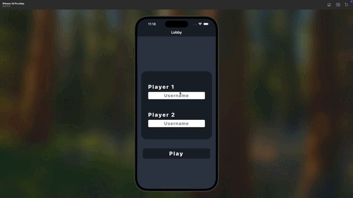
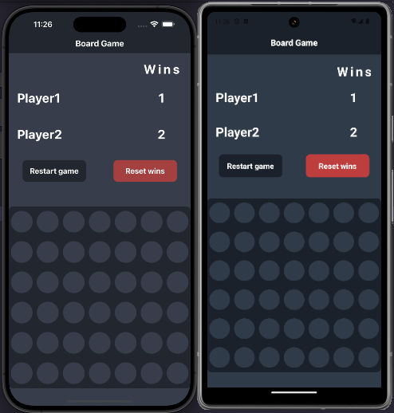

# Conecta 4

¡Bienvenido a **Conecta 4**!
Una versión digital del clásico juego de mesa, desarrollada con **React Native** y **Expo**.



---

## 🚀 Características

* **Multijugador local**: Juega con tus amigos en el mismo dispositivo.
* **Interfaz intuitiva**: Diseño limpio y responsivo para una experiencia de usuario óptima.
* **Gestión de estado eficiente**: Utiliza **Zustand** para un manejo sencillo y eficaz del estado global.
* **Reinicio de partidas**: Reinicia el juego en cualquier momento para una nueva ronda.
* **Contador de victorias**: Lleva un registro de las victorias de cada jugador.

---

## 🧱 Tecnologías utilizadas

* [React Native](https://reactnative.dev/)
* [Expo](https://expo.dev/)
* [Zustand](https://github.com/pmndrs/zustand)
* [TypeScript](https://www.typescriptlang.org/)

---

## 📦 Instalación y ejecución

1. **Clona el repositorio:**

   ```bash
   git clone https://github.com/Abrotello/conecta-4.git
   cd conecta-4
   ```

2. **Instala las dependencias:**

   ```bash
   npm install
   ```

3. **Inicia la aplicación:**

   ```bash
   npx expo start
   ```

   Luego, escanea el código QR con la aplicación Expo Go en tu dispositivo móvil o utiliza un emulador.

---

## 🕹️ Cómo jugar

1. **Inicio del juego**: Al abrir la aplicación, se te pedirá que ingreses los nombres de los dos jugadores.
2. **Turnos**: Los jugadores se turnan para soltar fichas en las columnas del tablero.
3. **Objetivo**: El primer jugador en alinear cuatro fichas del mismo color en línea recta (horizontal, vertical o diagonal) gana la partida.
4. **Reinicio**: Puedes reiniciar el juego en cualquier momento utilizando el botón de reinicio.

---

## 🧪 Capturas de pantalla


*Pantalla de inicio donde se ingresan los nombres de los jugadores.*



*Tablero de juego con fichas en juego.*

---

## 📬 Contacto

¿Tienes preguntas o sugerencias? No dudes en contactarme:

* GitHub: [@Abrotello](https://github.com/Abrotello)